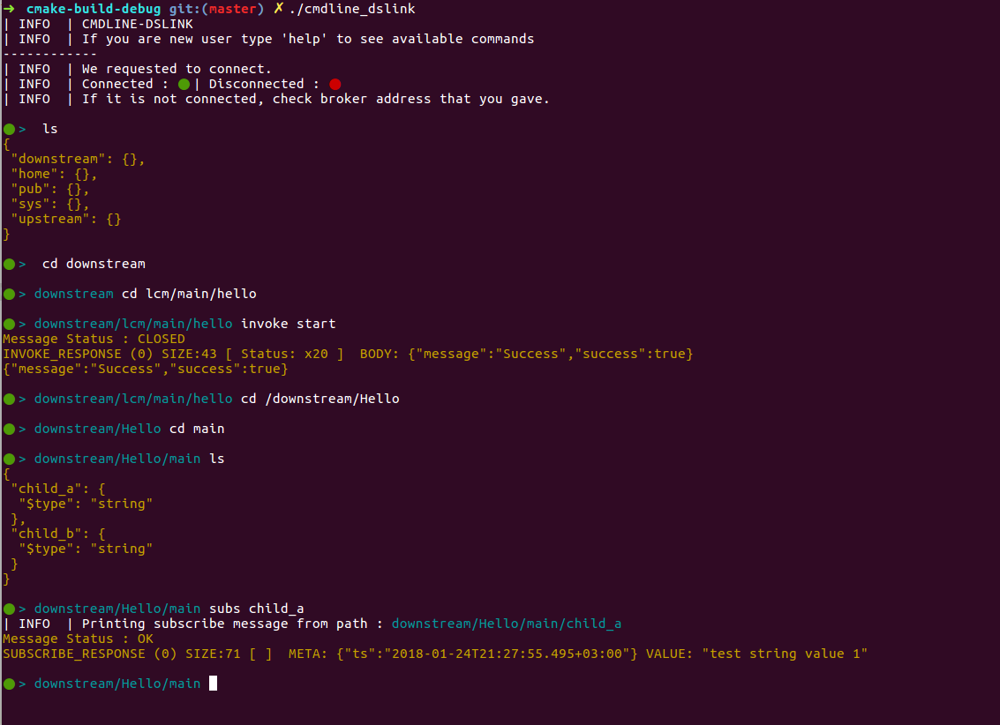

# cmd-dslink-cpp
It is a dslink that you can control it from command line with commands.



## command: ls | list | dir
List to given directory and close the stream after listing.

`> ls` -> lists current directory

`> ls .` -> lists current directory

`> ls TARGET_PATH` -> list to target path

`> ls "TARGET PATH"` -> list to target path including space

> If you put "stream" in front it like `stream list PATH` or `stream list` it doesn't close the stream so you can take updates in real time from server.
## command: cd
Changes current directory to given directory. If there is '/' given in beginning it overrides current directory.

`> cd /` -> navigates to the root

`> cd TARGET_PATH` -> navigates to target path

`> cd ..` -> navigates to one level back

`> cd .` -> does nothing, you are still same directory
## command: subscribe | subs
Subscribes to the path. You can give options for (level|size|duration|priority) and these values like ```level=0``` ```size=96``` ```duration=100``` or ```priority=false```. You can not put space for equal signs.

`>subscribe PATH` -> subscribe to the path

`>subscribe PATH level=0` -> subscribe to the path with level 0

`>subscribe PATH priority=false` -> subscribe to the path with priority false

`>subscribe PATH size=256 priority=false` -> subscribe to the path with size 256 and priority false

`>subscribe PATH level=0 size=244 duration=255 priority=true` -> all options usage example
> If you put "stream" in front it like `stream subs PATH` it doesn't close the stream so you can take updates in real time from server.
## Var
A type which based on msgpack. It can be:
* any type of json string `{"key":5}`
* integer `5`
* double `5.5`
* string `"hello"`
* `null`
* `true` | `false`
* array `[5,3,2,"sdf",3.2,null]`
* binary with BASE64 encapsulated with `"\u0001Bbytes:`BASE64`"`
* file : check below

## inplace: binary_file | text_file
Open file content from path and inplace file content into Var.

`> invoke install_from_zip {"name":"mynewdslink", "zip":binary_file(myzip.zip)}` -> open myzip.zip and dumps file content to "zip"

## command: set
set a path with given value and optional attribe from server.

`> set PATH Var` -> set PATH with given VAR

`> set PATH Var ATTRIBUTE` -> set ATTRIBUTE in PATH with given VAR
## command: invoke
Invoke a path from server.

`> invoke PATH` -> invoke PATH

`> invoke PATH Var` -> invoke PATH with given Var
## prefix: debug
When you put in front of any command, system opens logs for dslink for command runtime.

`> debug invoke PATH`

`> debug ls`

## command: quit | q | exit
Stops its link and exits.

## command: timeout
Sometimes server don't respond so cmd waits TIMEOUT milisecond and than inform the user about it and gives a chance to cancel it. You can set the time between begining command and asking user to cancel it.

`> timeout 2000` -> sets 2 seconds

## Examples

`> invoke install_from_zip {"name":"mynewdslink", "zip":binary_file(myzip.zip)}`